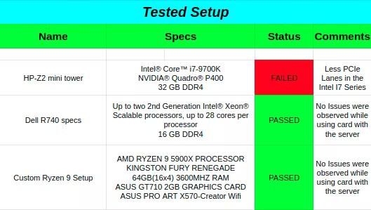
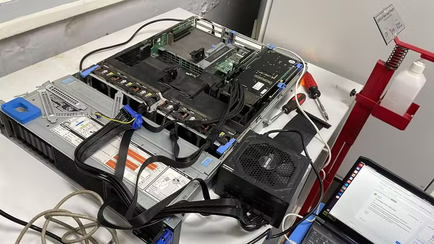

# Deepfake Inference on VCK5000

# CHAPTER 1: Introduction and Setup

## 1.1 Abstract:

Better generative models and larger datasets have led to more realistic fake videos that can fool the human eye and machines. Today, the danger of fake news is widely acknowledged, and in a context where more than 100 million hours of video content are watched daily on social networks, the spread of falsified videos raises more and more concerns.

Because of the rapid increase in technology and faster computation speeds, in the future, deep fake videos can be seen and broadcast live, everywhere, for example, on live news channels, streaming websites like Youtube, Twitch, Instagram etc. Effective detection is important to combat the malicious spread and use of deepfakes videos.


For Example on March 16, a video claiming to show Ukraine President Volodymyr Zelenskyy calling for the Ukrainian people to surrender to Russia was aired on news station Ukraine 24, and [circulated on social media](https://twitter.com/_delanay/status/1504048298520371201).

This Shows the need for faster decoding of such deepfaked videos before going viral. We are aiming to increase the deepfake inference using Xilinx's VCK5000 AI Versal Card.

## 1.2 Problem statement:

### DEEPFAKE D-I-R (Detection-Inference-Restoration)

* **Detection:** Identifying manipulated regions by creating a segmentation mask and improving detections using the mask.         
* **Inference:** Utilizing FPGA hardware-based acceleration for reducing inference time and power requirements compared to traditional methods.           
* **Restoration:** Restoring the original face of the person on whom the deepfake video was created.              

## 1.3 Flowchart:


## 1.4 Hardware Setup:

We had tried setting up the VCK5000 on various system, following are the details about the setups that we had tried:


Finally, we have been continuously running the VCK5000 Card on the Dell R740 Server. Here are some Images attached of our final setup
 

Note 1: Guidelines for the VCK5000 Card Installation Can be found here: https://www.xilinx.com/member/vck5000-aie.html (This is asecured site, you need to request for the same)
Note 2: We have used external SMPS for the VCK5000 AUX Power Supply. The R740 Dell Server didn't have the same connector. <br>
Note 3: Following Aliases, we often use to validate and check the temperature of VCK5000.

## 1.5 VCK5000 Software Setup:

After the Hardware Installation first check whether the card is getting detected or not using the following command: 

`lspci -vd 10ee:`

The output should be similar to like this:
```
02:00.0 Processing accelerators: Xilinx Corporation Device 5044

        Subsystem: Xilinx Corporation Device 000e

        Flags: bus master, fast devsel, latency 0, IRQ 16, NUMA node 0

        Memory at 380030000000 (64-bit, prefetchable) [size=128M]

        Memory at 380038020000 (64-bit, prefetchable) [size=128K]

        Capabilities: <access denied>

        Kernel driver in use: xclmgmt

        Kernel modules: xclmgmt

02:00.1 Processing accelerators: Xilinx Corporation Device 5045

        Subsystem: Xilinx Corporation Device 000e

        Flags: bus master, fast devsel, latency 0, IRQ 17, NUMA node 0

        Memory at 380038000000 (64-bit, prefetchable) [size=128K]

        Memory at 380028000000 (64-bit, prefetchable) [size=128M]

        Memory at 380038040000 (64-bit, prefetchable) [size=64K]

        Capabilities: <access denied>

        Kernel driver in use: xocl

        Kernel modules: xocl
```

Afterward, follow these steps:

```
#The Kernel We are using Right Now:
vedant@vck5000:~$ uname -a
Linux vck5000 5.4.0-100-generic #113-Ubuntu SMP Thu Feb 3 18:43:29 UTC 2022 x86_64 x86_64 x86_64 GNU/Linux 

# Clone the Vitis AI 1.4.1 Repo:
https://github.com/Xilinx/Vitis-AI.git
cd Vitis-AI/
git checkout 1.4.1 

# go to the setup directory of VCK5000:
cd setup/vck5000/

# Install the XRT and other modules using the script given in the repo
source ./install.sh

# Installl deb packages for the card
wget https://www.xilinx.com/bin/public/openDownload?filename=xilinx-vck5000-es1-gen3x16-platform-2-1_all.deb.tar.gz -O xilinx-vck5000-es1-g en3x16-platform-2-1_all.deb.tar.gz
tar -xzvf xilinx-vck5000-es1-gen3x16-platform-2-1_all.deb.tar.gz
sudo dpkg -i xilinx-sc-fw-vck5000_4.4.6-2.e1f5e26_all.deb 
sudo dpkg -i xilinx-vck5000-es1-gen3x16-validate_2-3123623_all.deb 
sudo dpkg -i xilinx-vck5000-es1-gen3x16-base_2-3123623_all.deb

# Flash the card:
sudo /opt/xilinx/xrt/bin/xbmgmt flash --scan 
sudo /opt/xilinx/xrt/bin/xbmgmt flash --update

# DO the cold reboot of the system and validate the card
sudo /opt/xilinx/xrt/bin/xbutil validate --device 0000:01:00.1
```

## 1.6 Validating VCK5000 setup

We will be validating the software and hardware setup of vck5000 by running a few simple video and image classification sample models from Vitis AI.

First Download the Vitis AI Images and Video Samples:
```bash
wget https://www.xilinx.com/bin/public/openDownload?filename=vitis_ai_library_r1.4.0_images.tar.gz -O vitis_ai_library_r1.4.0_images.tar.gz
wget https://www.xilinx.com/bin/public/openDownload?filename=vitis_ai_library_r1.4.0_video.tar.gz -O vitis_ai_library_r1.4.0_video.tar.gz
tar -xzvf vitis_ai_library_r1.4.0_images.tar.gz -C demo/Vitis-AI-Library/
tar -xzvf vitis_ai_library_r1.4.0_video.tar.gz -C demo/Vitis-AI-Library/
```

Then do the following steps to run ssd_traffic_pruned_0_9:

```bash
cd /usr/share/vitis_ai_library/
sudo mkdir models
cd models
sudo wget -O ssd_traffic_pruned_0_9 https://www.xilinx.com/bin/public/openDownload?filename=ssd_traffic_pruned_0_9-vck5000-DPUCVDX8H-r1.4.1.tar.gz
sudo tar -xvzf ssd_traffic_pruned_0_9
cd ../samples/ssd
./test_video_ssd ssd_traffic_pruned_0_9 /workspace/demo/Vitis-AI-Library/samples/classification/video_analysis/video/structure.webm -t 8
```

Note:
If you are getting any sort of error in displaying in the video then follow these steps:

On Host Computer:

```bash
export DISPLAY=':0'
xhost +
```

Add this in the docker_run.sh

`-e DISPLAY=$DISPLAY -v /tmp/.X11-unix:/tmp/.X11-unix -v $HOME/.Xauthority:/tmp/.Xauthority \`

After the docker is on, run the following commands:

```bash
cp /tmp/.Xauthority ~/
sudo chown vitis-ai-user:vitis-ai-group ~/.Xauthority
```

# CHAPTER 2: Deep Learning Model
## 2.1 U-YNet Model

There are many pre-trained models that perform deepfakes classification and localization tasks separately, but there are no models that do the task simultaneously. Such models where 2 tasks share the same backbone are called multi-task models.

We are using this architecture as the tasks performed by the multi-tasking models have the advantage of learning from each other; i.e., in our model, the classification task learns from the segmentation task, hence improving the accuracy and vice-versa. We call this model the U-YNet architecture as the 2 tasks share a UNet backbone.


## 2.2 Dataset

All currently available public DeepFake datasets include both real and manipulated videos and images. There are many datasets like UADFV, FaceForensics++, CelebDF, Google DFD and the DFDC dataset. Fake videos were generated from these recorded or collected videos using different DeepFake generators.


As we can see from the above diagram DFDC is currently the largest available deepfakes dataset with the most number of videos and faces. So we decided to choose this dataset over others for training the model.


The dataset does not come with the segmentation masks that we need for training the segmentation branch of the U-YNet model. To create the mask, we generate a pixel-wise difference mask by calculating the Structural Similarity Index (SSIM) between the frame of a real, and its corresponding fake video. This difference mask contains 1 for manipulated pixels and 0 for real ones.


One problem observed while training models is that, initially we were getting 99% accuracy on the DFDC dataset, which meant that the model was overfitting. After insinuating on this problem, we found the reason. While randomly splitting the dataset into testing, training, and validation datasets, the training dataset had examples of all the faces in the dataset. So the model was basically learning/remembering the faces and not the deepfake features. So, while testing the model on the testing dataset, the model was giving very high accuracy. This problem is called data leakage.

To solve this problem we used the information given in the metadata.json file that DFDC provides. metadata.json file provides the mapping of fake faces to the real faces from which they were produced. We split the dataset such that the testing data had no faces similar to those in the training dataset.

## 2.3 Training
- clone the GitHub repository  
`git clone https://github.com/DeepYNet/Deepfakes-classification-and-segmentation-models.git`
- cd to the UYNet directory  
`cd Deepfakes-classification-and-segmentation-models`
- Change the path according to your dataset at lines 20, 21, 23, 24 in the fyp_train.py file.
- Run the training code  
`python fyp_train.py`
- The code also has wandb integration. So the model metrics can be observed easily from their website. You will get the link to the wandb site printed on your terminal after running your code.

You can run the model for as long as you want. We trained the U-YNet model for 25 epochs on the NVIDIA DGX GPU. The weights will be saved after every 2 epochs and can be found in the checkpoints folder.  
If you want to use the pre-trained weights. You can download the weights from this link and put the weights in the checkpoints folder.  
If you are facing `CUDA MEMORY ERROR` then just decrease the num-workers and `batch size` parameters.

## 2.4 Evaluation
The input image is the face from the input frame and there will be 2 outputs: One from the classification branch which will be a 0 for "fake" class prediction and 1 for "real" class prediction; the other output is the segmentation mask, which will have the same shape as the input image. It will have 1 as a pixel value for "fake" class prediction and 0 for "real" class prediction.  

To test the model output, run the fyp_predict.ipynb cell by cell. You will get output  like:

  

In the below image we can see more predictions on input fake images.  


You can even get the number of correct and wrong predictions in the test dataset. Run:
`python fyp_results.py`  

We got an accuracy of `94.35%` on the test dataset.

## 2.5 Demo
[](https://youtu.be/5V2xu6M-31M)

# CHAPTER 3: Deploy Process On VCK5000

Once the model has been successfully trained and the best weights have been selected, we will then proceed to quantize and compile the model for deployment on the VCK5000 FPGA.

## 3.1 Quantization

For proceeding towards quantization which is the first step towards deploying the model on VCK5000, we will first activate the Vitis-AI docker and then activate the anaconda environment for Pytorch via the following command:

`conda activate vitis-ai-pytorch`

Once this has been done, we will proceed to the directory where our quantization scripts are located. As we can see in the quantization script, we will have to import the torch_qauntizer and the dump_xmodel from the pytorch_nndct library. These are required for quantizing the model.

We will load our floating-point model and load them in the same way as we had done while testing the model for inference. For quantization, we will take our validation dataset and rename it as the calibration dataset. The reason we require a calibration dataset is that we will need to calibrate or estimate the range (min, max) of all floating-point tensors in the model. Unlike constant tensors such as weights and biases, variable tensors such as model input, activations (outputs of intermediate layers), and model output cannot be calibrated unless we run a few inference cycles. Vitis AI recommends a small calibration dataset size of 100-1000 images.

The torch_qauntizer replaces the floating module with a quantized module. It takes the model which we had loaded and an input tensor with the same dimension on which it has been trained. The following code snippet shows how we have passed the variables to the torch_qauntizer:

```python
rand_in = torch.randn([batch_size, 3, 224, 224]).cuda()
quantizer = torch_quantizer(quant_mode, net, (rand_in), output_dir=quant_model) 
quantized_model = quantizer.quant_model
```

(NOTE: It is recommended to load the model and apply the quantization process on the GPU as it speeds up the process; otherwise applying it on the CPU will also work)

The quant_mode decides whether the model is to be calibrated or evaluated. Calibration mode determines quantization steps of tensors in the evaluation process if flag quant_mode is set to "calib". After calibration, we can evaluate the quantized model by setting quant_mode to "test".

First of all download the weights of the model:

```bash
git clone https://github.com/DeepYNet/Deepfake_Inference_On_VCK5000
cd deepfake_vitis_ai/build/float_model/
gdown https://drive.google.com/uc?id=1pmXnmlShfY9eIOAqmx8H_iBIOTNnNbw3
```

Then run quant script using:

```bash
cd deepfake_vitis_ai/
python quant.py --quant_mode calib -b 8
```

The Quantize calibration step determines the quantization step of tensors in evaluation process if the flag quant_mode is set to calib.

Then run quant script again for evaluating the model

`python quant.py --quant_mode test`

After calibration, by setting the quant_mode flag to test , we can evaluate the quantized model with it. The accuracy received at the end of this step is the right accuracy for the quantized model. **An xmodel file will be generated in the quant_model folder which is later used for DPU compilation.**

## 3.2 Compiler

The Vitis AI Compiler generates the compiled model based on the DPU microarchitecture. There are a number of different DPUs supported in Vitis AI for different platforms and applications.

We are using this DPUCVDX8H on VCK5000:

**To compile the model for VCK5000 DPU:**

`vai_c_xir -x vck_5000_class_weight/UNet_int.xmodel -a /opt/vitis_ai/compiler/arch/DPUCVDX8H/VCK5000/arch.json -o vck_5000_class_weight/ -n unet_deploy_classification`

## 3.3 Inference:

For Inference on VCK5000, we are using VART APIs and we have primarily used MNIST Inference script from Vitis AI Tutorials as Reference (https://github.com/Xilinx/Vitis-AI-Tutorials/tree/master/Design_Tutorials/02-MNIST_classification_tf)

First, we resize our Input Image to 224 x 224 then we divide the Input Image by 255 to convert the range from 0-255 to 0-1.0 range. The Images get appended to a list which is then passed to the model loaded into VCK5000.

We then append the images in a list and pass it onto the compiled model which is loaded into the VCK5000. VCK5000 takes the images in batches of 8 and gives us 2 output, the output segmented mask, and a classification label that tells us if the image or video is a deep fake content or not. The segmented output is stored in a .npy format for post processing so we could visualize the output in a jupyter notebook.

The classification output is given at the end of the inference code which tells us how well the model performed on unseen data. A Json file contains the label for unseen data, we compare it with the model output and print the accuracy of how well it performs.

To execute the inference code on VCK5000 run the below command

`python app_mt_demo_hackster.py --images unseen_data/crops --model YNET_FFT.xmodel -t 12`

# CHAPTER 4: RESULTS
- vedant 

# CHAPTER 5: Future Goals

Our project provides classification outputs on deepfaked videos, which is an important piece of information. In the future, we would like to make a simple easy-to-use extension that will accept user's input and forward it to the Cloud FPGA farm such as Alveo, VCK5000 which will detect the deepfaked video in real-time.

Our project also provides segmentation output. This output can be used as the first stage towards deepfakes restoration, i.e finding the culprit behind the deepfake.

In this project, we had tried accessing VCK5000 AIE cores using Vitis Flow, but unfortunately, the VCK5000 didn't have vitis flow supported. In the future, we would like to perform pre and post-processing related operations on FPGA itself hereby increasing the total Inference time of deepfake detection.

# CHAPTER 6: Conclusion 

We are a group of undergrad students from VJTI, Mumbai. We are a part of a Research Group at our university with expertise in deepfake detection. Because of the rapid increase in technology and faster computation speeds, deepfake generation was one of the concerns in the upcoming era.

In this project, we were able to accelerate deepfake detection on VCK5000. We were able to classify the deepfaked images as well as videos on the Accelerated DPU, AIE cores on VCK5000.

We have observed that VCK5000 beats various other inference nodes like Nvidia T4, as well as Nvidia DGX 1 and other GPUs like RTX 3060.

In short following image describes the performance of the VCK5000 Card by Xilinx: 


